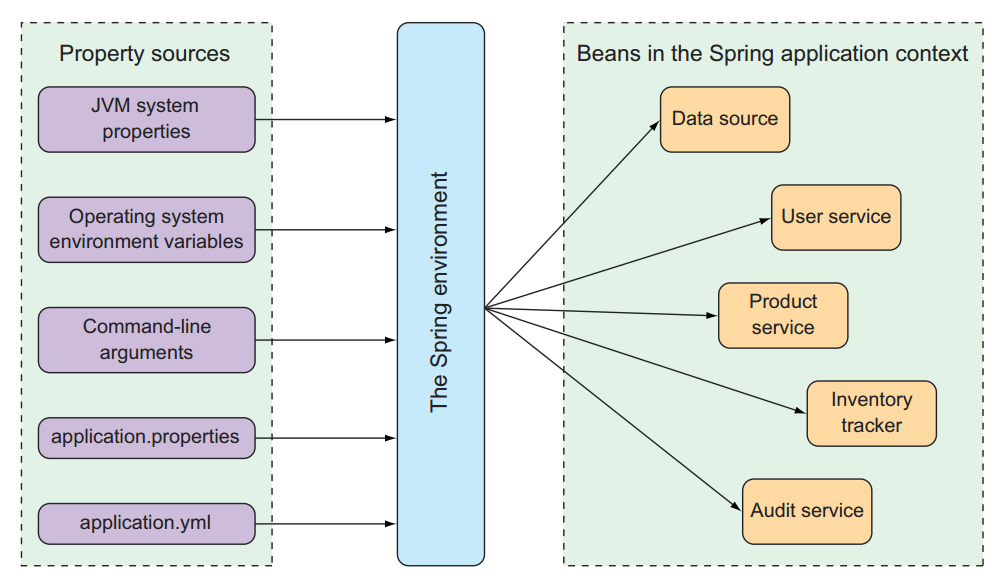

## Chapter 6: Working with Configuration Properties
### Fine-tuning Autoconfiguration
- _Bean wiring_: Configuration that declares application components to be created
as beans in the Spring context and how they should be injected into each other.
- _Property injection_: Configuration that sets values on beans in the Spring 
application context. 

In Spring's XML and Java configuration, these two types of configurations are 
often declared explicitly in the same place. For example, let us consider the 
following `@Bean` method that declares a DataSource for an embedded H2 database:

```java
import org.springframework.context.annotation.Bean;
import org.springframework.jdbc.datasource.embedded.EmbeddedDatabaseBuilder;
import org.springframework.jdbc.datasource.embedded.EmbeddedDatabaseType;

import javax.sql.DataSource;

@Bean
public DataSource dataSource() {
    return new EmbeddedDatabaseBuilder()
            .setType(EmbeddedDatabaseType.H2)
            .addScript("taco_schema.sql")
            .addScript("user_data.sql", "ingredient_data.sql")
            .build();
}
```
Whereas this is how we might configure a DataSource bean if we aren't using Spring Boot,
autoconfiguration makes this method completely unnecessary. 

But what if we want to name the SQL scripts something else? Or what if we need to specify
more than two SQL scripts? That's where configuration properties come in. But before we
can start using configuration properties, we need to understand where those properties
come from. 

#### Understanding Spring's environment abstraction
The Spring environment pulls from several property sources, including the following:
- JVM system properties
- Operating system environment variables
- Command-line arguments
- Application property configuration files

_Following figure illustrates how properties from property sources flow through the 
Spring environment abstraction to Spring beans._ 

As a simple example, suppose that we would like the application's underlying servlet
container to listen for requests on some port other than the default port of 8080. 
To do that, we can specify a different port by setting the `server.port` property in
**src/main/resources/application.properties** like this: 
```properties
server.port=9090
```
Using YAML, it will be like 
```yaml
server:
  port: 9090
```
If we'd prefer to configure that property externally, we could specify the port when
starting the application using a command-line argument as follows: 
```shell
$ java -jar tacocloud-0.0.5-SNAPSHOT.jar --server.port=9090
```
If we want the application to always start on a specific port, we could set it one time
as an operating system environment variable, as shown below: 
```shell
$ export SERVER_PORT=9090
```

#### Configuring a data source
Although we could explicitly configure our own DataSource bean, that's usually unnecessary. 
Instead, it's simpler to configure the URL and credentials for our database via configuration
properties. For example: 
```yaml
spring: 
  datasource:
    url: jdbc:mysql://localhost/tacocloud
    username: tacouser
    password: tacopassword
    driver-class-name: com.mysql.jdbc.Driver
```
The DataSource bean will be pooled using the **HikariCP** connection pool if it's 
available on the classpath. If not, Spring Boot looks for and uses one of the following
other connection pool implementations on the classpath: 
- Tomcat JDBC Connection Pool
- Apache Commons DBCP2

Earlier, we suggested that there might be a way to specify the database initialization
scripts to run when the application starts. We can do that in Spring Boot like following: 
```yaml
spring: 
  datasource: 
    schema: 
    - order-schema.sql
    - ingredient-schema.sql
    - taco-schema.sql
    - user-schema.sql
    data: 
    - ingredients.sql
```
If we'd prefer to configure our data source in the Java Naming and Directory 
Interface (JNDI) and have Spring look it up from there, we can set up our data source
by configuring `spring.datasource.jndi-name` as follows: 
```yaml
spring: 
  datasource:
    jndi-name: java:/comp/env/jdbc/tacoCloudDS
```
_If we set the `spring.datasource.jndi-name` property, the other data source 
connection properties (if set) are ignored._

#### Configuring the embedded server
What happens if `server.port` is set to 0, as shown below: 
```yaml
server: 
  port: 0
```
Although, we're explicitly setting the port to 0, the server won't start on port 0. 
Instead, it'll start on a randomly chosen available port. This is useful when 
running automated integration tests to ensure that any concurrently running tests 
don't clash on a hardcoded port number. 

One of the most common things we'll need to do with the underlying container is to 
set it up to handle HTTPS requests. To do that, the first thing we must do is create 
a keystore using the JDK's `keytool` command-line utility, as shown next: 
```shell
$ keytool -keystore mykeys.jks -genkey -alias tomcat -keyalg RSA
```
Next, we'll need to set a few properties to enable HTTPS in the embedded server. We 
will set them in the `application.properties` or `application.yml` file. 
```yaml
server: 
  port: 8443
  ssl: 
    key-store: file:///path/to/mykeys.jks
    key-store-password: letmein
    key-password: letmein
```

#### Configuring logging
By default, Spring Boot configures logging via Logback to write to the console at an 
`INFO` level. For full control over the logging configuration, we can create a 
`logback.xml` file at the root of the classpath (in **src/main/resources**). Here's 
an example of a simple logback.xml we might use:

```xml

<configuration>
    <appender name="STDOUT" class="ch.qos.logback.core.ConsoleAppender">
        <encoder>
            <pattern>
                %d{HH:mm:ss.SSS} [%thread] %-5level %logger{36} - %msg%n
            </pattern>
        </encoder>
    </appender>
    <logger name="root" level="INFO"/>
    <root level="INFO">
        <appender-ref ref="STDOUT"/>
    </root>
</configuration>
```
The most common changes we'll make to a logging configuration are to change the 
logging levels and perhaps to specify a file where the logs should be written. With
Spring Boot configuration properties, we can make those changes without having to 
create a logback.xml file. To set the logging levels we create properties that are 
prefixed with `logging.level`, followed by the name of the logger for which we want 
to set the logging level. 

For instance, suppose we'd like to set the root logging level to `WARN`, but log 
Spring Security logs at a `DEBUG` level. The following entries will take care of that: 
```yaml
logging: 
  level: 
    root: WARN
    org: 
      springframework: 
        security: DEBUG
```
Now, suppose that we want to write the log entries to the file TacoCloud.log at 
/var/logs/. The `logging.file.path` and `logging.file.name` properties can help: 
```yaml
logging: 
  file: 
    path: /var/logs/
    file: TacoCloud.log
  level: 
    root: WARN
    org.springframework.security: DEBUG
```
_By default, the log files rotate once they reach 10 MB in size._

#### Using special property values
When setting properties, we can derive their values from other configuration
properties. For example, suppose we want to set a property named `greeting.welcome`
to echo the value of another property named `spring.application.name`. To achieve 
this we can use the `${}` placeholder like follows: 
```yaml
greeting: 
  welcome: ${spring.application.name}
```
We can even embed that placeholder amid other text, as shown below: 
```yaml
greeting: 
  welcome: You are using ${spring.application.name}.
```

### Creating Our Own Configuration Properties
To support property injection of configuration properties, Spring Boot provides the 
`@ConfigurationProperties` annotation. When placed on any Spring bean, it specifies 
that the properties of that bean can be injected from properties in the Spring 
environment. 

To demonstrate, suppose that we've added the following method to `OrderController` to
list the authenticated user's past orders:

```java
import com.azad.tacocloud.tacos.User;
import org.springframework.security.core.annotation.AuthenticationPrincipal;
import org.springframework.ui.Model;
import org.springframework.web.bind.annotation.GetMapping;

@GetMapping
public String ordersForUser(@AuthenticationPrincipal User user, Model model) {
    model.addAttribute("orders", orderRepository.findByUserOrderByPlacedAtDesc(user));
    return "orderList";
}
```
Along with that, we've also added the next necessary `findByUserOrderByPlacedAtDesc()`
method to `OrderRepository`:

```java
import com.azad.tacocloud.tacos.TacoOrder;
import com.azad.tacocloud.tacos.User;

import java.util.List;

List<TacoOrder> findByUserOrderByPlacedAtDesc(User user);
```
As written, this controller method may be useful after the user has placed a handful 
of orders. A few order displayed in the browser are useful; a never-ending list of 
hundreds of orders is just noise. Let's say we want to limit the number of orders 
displayed to the most recent 20 orders. We do that by change the method to following:

```java
import org.springframework.data.domain.PageRequest;
import org.springframework.data.domain.Pageable;

@GetMapping
public String ordersForUser(@AuthenticationPrincipal User user, Model model) {
    Pageable pageable = PageRequest.of(0, 20);
    model.addAttribute("orders", orderRepository.findByUserOrderByPlacedAtDesc(user, pageable));
    return "orderList";
}
```
Along with the corresponding changes to `OrderRepository`, as shown next:

```java
import org.springframework.data.domain.Pageable;

List<TacoOrder> findByUserOrderByPlacedAtDesc(User user, Pageable pageable);
```
`Pageable` is Spring Data's way of selecting some subset of the results by a page 
number and page size. Although this works, but we've hardcoded the page size. 

Rather than hardcode the page size, we can set it with a custom configuration property. 
First, we need to add a new property called `pageSize` to `OrderController`, and then 
annotate `OrderController` with `@ConfigurationProperties` as shown next:

```java
import org.springframework.boot.context.properties.ConfigurationProperties;
import org.springframework.stereotype.Controller;
import org.springframework.web.bind.annotation.RequestMapping;
import org.springframework.web.bind.annotation.SessionAttributes;

@Controller
@RequestMapping("/orders")
@SessionAttributes("order")
@ConfigurationProperties(prefix = "taco.orders")
public class OrderController {
    private int pageSize = 20;
    
    public void setPageSize(int pageSize) {
        this.pageSize = pageSize;
    }
    // ...
    @GetMapping
    public String ordersForUser(@AuthenticationPrincipal User user, Model model) {
        Pageable pageable = PageRequest.of(0, pageSize);
        model.addAttribute("orders", orderRepository.findByUserOrderByPlacedAtDesc(user, pageable));
        return "orderList";
    }
}
```
The `@ConfigurationProperties`'s prefix attribute is set to `taco.orders`, which 
means that when setting the `pageSize` property, we need to use a configuration 
property named `taco.orders.pageSize`. We could set this property in the properties 
file: 
```yaml
taco: 
  orders: 
    pageSize: 10
```

#### Defining configuration property holders
There's nothing that says `@ConfigurationProperties` must be set on a controller or 
any other specific kind of bean. `@ConfigurationProperties` are in fact often placed 
on beans whose sole purpose in the application is to be holders of configuration data. 

In the case of the `pageSize` property in `OrderController`, we could extract it to 
a separate class.

```java
import lombok.Data;
import org.springframework.boot.context.properties.ConfigurationProperties;
import org.springframework.stereotype.Component;

@Component
@ConfigurationProperties(prefix = "taco.orders")
@Data
public class OrderProps {
    private int pageSize = 20;
}
```
The next step is to inject the `OrderProps` bean into `OrderController`. This means, 
removing the `pageSize` property from `OrderController` and instead injecting and 
using the `OrderProps` bean, as shown next:

```java
private OrderProps props;

public OrderController(OrderRepository orderRepository, OrderProps props) {
    this.orderRepository = orderRepository;
    this.props = props;
}
// ...
@GetMapping
public String ordersForUser(@AuthenticationPrincipal User user, Model model) {
    Pageable pageable = PageRequest.of(0, props.getPageSize());
    model.addAttribute("orders", orderRepository.findByUserOrderByPlacedAtDesc(user, pageable));
    return "orderList";
}
```
Let's pretend that we're using the `pageSize` property in several other beans when 
we decide it would be best to apply some validation to that property to limit its 
value to no less than 5 and no more than 25. Without a holder bean, we'd have to 
apply validation annotations to `OrderController`, the `pageSize` property, and all
other classes using that property. But because we've extracted `pageSize` into 
`OrderProps`, we only must make the changes to `OrderProps`, as shown next:

```java
import jakarta.validation.constraints.Max;
import jakarta.validation.constraints.Min;

import org.springframework.boot.context.properties.ConfigurationProperties;
import org.springframework.stereotype.Component;
import org.springframework.validation.annotation.Validated;

import lombok.Data;

@Component
@ConfigurationProperties(prefix = "taco.orders")
@Data
@Validated
public class OrderProps {
    @Min(value = 5, message = "must be between 5 and 25")
    @Max(value = 25, message = "must be between 5 and 25")
    private int pageSize = 20;
}
```

#### Declaring configuration property metadata
To create metadata for our custom configuration properties, we'll need to create a 
file under the **META-INF** (e.g., in the project under src/main/resources/META-INF)
named `additional-spring-configuration-metadata.json`. The following JSON code sample 
shows what the metadata might look like: 
```json
{
  "properties": [
    {
      "name": "taco.orders.page-size",
      "type": "java.lang.Integer",
      "description": "Sets the maximum number of orders to display in a list."
    }
  ]
}
```
### Configuring with Profiles
When applications are deployed to different runtime environments, usually some 
configuration details differ such as database connection configurations. One way to 
configure properties uniquely in one environment over another is to use environment
variables to specify configuration properties instead of defining them in 
`application.properties` and `appliation.yml`. 

For instance, during development we can lean on the autoconfigured embedded H2 database. 
But in production, we can set database configuration properties as environment variables
like this: 
```shell
% export SPRING_DATASOURCE_URL=jdbc:mysql://localhost/tacocloud
% export SPRING_DATASOURCE_USERNAME=tacouser
% export SPRING_DATASOURCE_PASSWORD=tacopassword
```
Although this wil work, but its cumbersome and there's no good way to track changes 
to environment variables or to easily roll back changes if there's a mistake. Instead,
we can take advantage of Spring profiles. 

Profiles are type of conditional configuration where different beans, configuration 
classes, and configuration properties are applied or ignored based on what profiles 
are active at run time. 

#### Defining profile-specific properties
One way to define profile-specific properties is to create yet another properties or 
YAML file containing only the properties for production. The name of the file should 
follow this convention: application-{profile name}.yml or application-{profile-name}.properties.
Then we can specify the configuration properties appropriate to that profile. For 
example, we could create a new file named application-prod.yml that contains the 
following properties: 
```yaml
spring: 
  datasource: 
    url: jdbc:mysql://localhost/tacocloud
    username: tacouser
    password: tacopassword
logging: 
  level: 
    tacos: WARN
```
Another way to specify profile-specific properties works only with YAML configuration. 
It involves placing profile-specific properties alongside non-profiled properties in 
application.yml, separated by three hyphens and the `spring.profiles` property to 
name the profile. When applying the production properties to application.yml in this 
way, the entire application.yml would look like this: 
```yaml
logging: 
  level: 
    tacos: DEBUG

---
spring: 
  profiles: prod

  datasource: 
    url: jdbc:mysql://localhost/tacocloud
    username: tacouser
    password: tacopassword

logging: 
  level: 
    tacos: WARN
```
This application.yml file is divided into two sections by a set of triple hyphens
(---). 

#### Activating profiles
All it takes to make a profile active is to include it in the list of profile names 
given to the `spring.profiles.active` property. For example, we could set it in 
application.yml like this: 
```yaml
spring: 
  profiles: 
    active: 
      - prod
```
But that's perhaps the worst possible way to set an active profile. If we set the active
profile in application.yml, then that profile becomes the default profile, and we achieve
none of the benefits of using profiles to separate the production-specific properties 
from development properties. Instead, the recommended way is that we set the active 
profile(s) with environment variables. On the production environment, we would set 
`SPRING_PROFILES_ACTIVE` like this: 
```shell
% export SPRING_PROFILES_ACTIVE=prod
```
From then on, any application deployed to that machine will have the `prod` profile active.

If we're running the application as an executable JAR file, we might also set the active 
profile with a command-line argument like this: 
```shell
% java -jar taco-cloud.jar --spring.profiles.active=prod
```
We can specify more than one active profile. Often, this is with a comma-separated list. 
```shell
% export SPRING_PROFILES_ACTIVE=prod,audit,qa
```
But in YAML, we'd specify it as a list like this: 
```yaml
spring: 
  profiles: 
    active: 
      - prod
      - audit
      - qa
```
If we deploy a Spring application to Cloud Foundry, a profile named cloud is automatically
activated for us. In that case, we'll want to be sure to specify production-specific 
properties under the `cloud` profile. 

#### Conditionally creating beans with profiles
Normally, any bean declared in a Java configuration class is created, regardless of which
profile is active. But suppose we need some beans to be created only if a certain profile 
is active. In that case, the `@Profile` annotation can designate beans as being applicable
to only a given profile. 

For instance, suppose we have a `CommandLineRunner` bean declared in `TacoCloudApplication`
that's used to load the embedded database with ingredient data when the application starts.
To prevent the ingredient data from being loaded every time the application starts in 
a production deployment, we could annotate the `CommandLineRunner` bean method with 
`@Profile` like this:

```java
import com.azad.tacocloud.tacos.data.IngredientRepository;
import com.azad.tacocloud.tacos.data.UserRepository;
import org.springframework.boot.CommandLineRunner;
import org.springframework.context.annotation.Bean;
import org.springframework.context.annotation.Profile;
import org.springframework.security.crypto.password.PasswordEncoder;

@Bean
@Profile("dev")
public CommandLineRunner dataLoader(IngredientRepository repo, UserRepository userRep, PasswordEncoder encoder) {
    // ...
}
```
Or suppose that we need the `CommandLineRunner` created if either the `dev` profile or 
`qa` profile is active. In that case, we can list the profiles for which the bean should 
be created like so:

```java
@Bean
@Profile({"dev", "qa"})
public CommandLineRunner dataLoader(IngredientRepository repo, UserRepository userRep, PasswordEncoder encoder) {
    // ...
}
```
It would be even more convenient if that `CommandLineRunner` bean were always created 
unless the `prod` profile is active. In that case, we can apply `@Profile` like this:

```java
@Bean
@Profile("!prod")
public CommandLineRunner dataLoader(IngredientRepository repo, UserRepository userRep, PasswordEncoder encoder) {
    // ...
}
```
Here, the exclamation mark (!) negates the profile name. 

It's also possible to use `@Profile` on an entire `@COnfiguration`-annotated class. For 
example, suppose that we were to extract the `CommandLineRunner` bean into a separate 
configuration class named `DevelopmentConfig`. Then we could annotate like this:

```java
import org.springframework.context.annotation.Bean;
import org.springframework.context.annotation.Configuration;
import org.springframework.context.annotation.Profile;

@Profile({"!prod", "!qa"})
@Configuration
public class DevelopmentConfig {
    @Bean
    public CommandLineRunner dataLoader(IngredientRepository repo, UserRepository userRep, PasswordEncoder encoder) {
        // ...
    }
}
```
Here the `CommandLineRunner` bean (as well as any other beans defined in `DevelopmentConfig`)
will be created only if neither the `prod` nor `qa` profile is active. 

### Chapter Summary
- We can annotate Spring beans with `@ConfigurationProperties` to enable injection of 
values from one of several property sources. 
- Configuration properties can be set in command-line arguments, environment variables, 
JVM system properties, properties files, or YAML files, among other options. 
- Use configuration properties to override autoconfiguration settings, including the 
ability to specify a data source URL and logging levels. 
- Spring profiles can be used with property sources to conditionally set configuration 
properties based on the active profile(s). 
