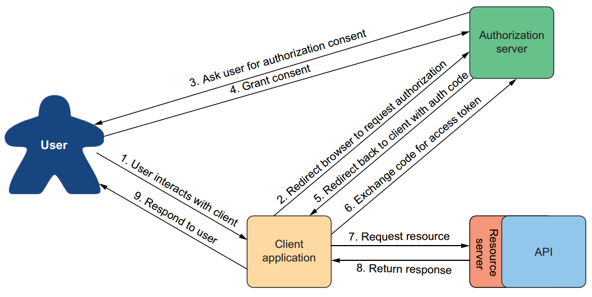

## Chapter 8: Securing REST
### Introducing OAuth 2
Suppose we have a REST controller to do administrative updates on Ingredients. 
If there's no security around that API then anyone can make HTTP requests to 
add or delete ingredients. Using the curl command-line client, someone could 
add a new ingredient like this: 
```shell
$ curl localhost:8080/ingredients \
  -H"Content-type: application/json" \
  -d'{"id":"FISH","name":"Stinky Fish","type":"PROTEIN"}'
```
They could even use curl to delete existing ingredients as follows: 
```shell
$ curl localhost:8080/ingredients/GRBF -X DELETE
```
The API is part of the main application and available to the world; in fact, the 
GET endpoint is used by the user interface of the main application in home.html. 
Therefore, it's clear that we'll need to secure at least the POST and DELETE 
endpoints. 

Once option is to use HTTP Basic authentication to secure the /ingredients 
endpoints. This could be done by adding `@PreAuthorize` to the handler methods 
like this:

```java
import com.azad.tacocloud.tacos.Ingredient;
import org.springframework.security.access.prepost.PreAuthorize;
import org.springframework.web.bind.annotation.DeleteMapping;
import org.springframework.web.bind.annotation.PathVariable;
import org.springframework.web.bind.annotation.PostMapping;
import org.springframework.web.bind.annotation.RequestBody;

@PostMapping
@PreAuthorize("#{hasRole('ADMIN')}")
public Ingredient saveIngredient(@RequestBody Ingredient ingredient) {
    return repo.save(ingredient);
}

@DeleteMapping("/{id}")
@PreAuthorize("#{hasRole('ADMIN')}")
public void deleteIngredient(@PathVariable("id") String ingredientId) {
    repo.deleteById(ingredientId);
}
```
Or, the endpoints could be secured in the security configuration like this:

```java
import org.springframework.http.HttpMethod;
import org.springframework.security.config.annotation.web.builders.HttpSecurity;

@Override
protected void configure(HttpSecurity http) throws Exception {
    http
            .authorizeHttpRequests(auth -> auth
                    .requestMatchers(HttpMethod.POST, "/ingredients")
                        .hasRole("ADMIN")
                    .requestMatchers(HttpMethod.DELETE, "ingredients/**")
                        .hasRole("ADMIN"))
            // ...
    ;
}
```
> **Whether or not to use the "ROLE_" prefix**
> 
> Authorities in Spring Security can take several forms, including roles, permissions,
> and OAuth2 scopes. Roles, specifically, are a specialized form of authority that
> are prefixed with "ROLE_".
> 
> When working with methods or SpEL expressions that deal directly with roles, 
> such as `hasRole()`, the "ROLE_" prefix is inferred. Thus, a call to `hasRole("ADMIN")`
> is internally checking for an authority whose name is "ROLE_ADMIN". 
> 
> Other Spring Security methods and functions that deal with authority more 
> generically can also be used to check for roles. But in those cases, we must 
> explicitly add the "ROLE_" prefix. For example, if we chose to use `hasAuthority()`
> instead of `hasRole()`, we'd need to pass in "ROLE_ADMIN" instead of "ADMIN". 

The ability to submit POST or DELETE requests to /ingredients will require that
the submitter also provide credentials that have "ROLE_ADMIN" authority. For 
example, using curl, the credentials can be specified with the -u parameter, as 
shown below: 
```shell
$ curl localhost:8080/ingredients \
  -H"Content-type: application/json" \
  -d'{"id":"FISH","name":"Stinky Fish","type":"PROTEIN"}' \
  -u admin:l3m31n
```

What if instead of requiring that the admin user identify themselves on every 
request, the API just asks for some token that proves that they are authorized to
access the resources? That's roughly how OAuth 2 authorization works. Client 
request an access token, from an authorization server, with the express permission
of a user. That token allows them to interact with an API on behalf of the user
who authorized the client. At any point, the token could expire or be revoked, 
without requiring that the user's password be changed. In such cases, the client
would just need to request a new access token to be able to continue acting on 
the user's behalf. The following figure explains the OAuth 2 authorization code
flow. 

For our purpose, we're going to focus on the authorization code grant flow to 
obtain a JSON Web Token (JWT) access token. This will involve creating a 
handful of applications that work together, including the following: 
- _The authorization server_ - An authorization server's job is to obtain 
permission from a user on behalf of a client application. If the user grants 
permission, then the authorization server gives an access token to the client 
application that it can use to gain authenticated access to an API. 
- _The resource server_ - A resource server is just another name for an API that
is secured by OAuth 2. The resource server restricts access to its resources 
unless the request provides a valid access token with the necessary permission
scope. 
- _The client application_ - The client application is an application that wants
to consume an API but needs permission to do so. 
- _The user_ - This is the human who uses the client application and grants the
application permission to access the resource server's API on their behalf. 
### Chapter Summary

