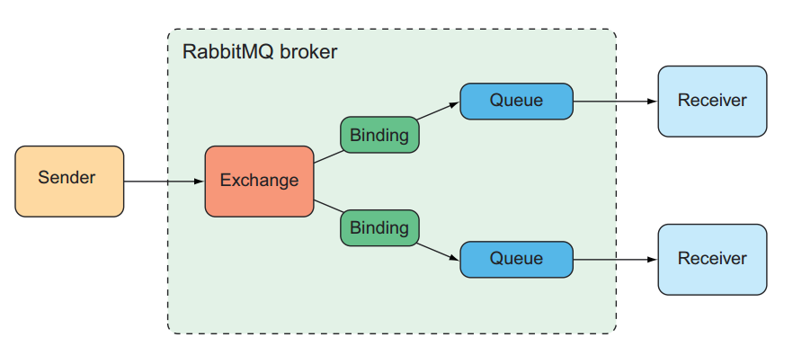

## Chapter 9: Sending Messages Asynchronously
There are at least three options that Spring offers for asynchronous messaging: 
- Java Message Service (JMS) 
- RabbitMQ and Advanced Message Queueing Protocol(AMQP)
- Apache Kafka

### Sending Messages with JMS
JMS is a Java standard that defines a common API for working with message brokers.
Before JMS, each message broker had a proprietary API, making an application's 
messaging code less portable between brokers. But with JMS, all compliant 
implementations can be worked with via a common interface in much same way that 
JDBC has given relational database operations a common interface. 

Spring supports JMS through a template-based abstraction known as `JmsTemplate`.
Using `JmsTemplate`, it's easy to send messages across queues and topics from the 
producer side and to receive those messages on the consumer side. Spring also 
supports the notion of message-driven POJOs: simple Java objects that react to 
message arriving at a queue or topic in an asynchronous fashion. 

#### Setting up JMS
Before we can use JMS, we must add a JMS client to our project's build. For this, 
all we need to do is add a starter dependency to the build. 

If we are using ActiveMQ, we'll need to add the following dependency to our 
project's pom.xml file. 
```xml
<dependency>
    <groupId>org.springframework.boot</groupId>
    <artifactId>spring-boot-starter-activemq</artifactId>
</dependency>
```
If ActiveMQ Artemis is the choice, the starter dependency should look like this: 
```xml
<dependency>
    <groupId>org.springframework.boot</groupId>
    <artifactId>spring-boot-starter-artemis</artifactId>
</dependency>
```
By default, Spring assumes that our Artemis broker is listening on localhost at 
port 61616 (or 8161). That's fine for development purposes, but once we're ready 
to send our application into production, we'll need to set a few properties that 
tell Spring how to access the broker. 

For example, we can consider the following entry from an application.yml file that
might be used in a non-development setting:
```yaml
spring: 
  artemis: 
    host: artemis.tacocloud.com
    port: 61617
    user: tacoweb
    password: l3tm31n
```
This sets up Spring to create a broker connections to an Artemis broker listening 
at artemis.tacocloud.com, port 61617. The credentials are optional, but they're 
recommended for production deployment. 

If we were to use ActiveMQ instead of Artemis, we'd need to use the ActiveMQ 
specific properties listed below: 
- `spring.activemq.broker-url` - The URL of the broker
- `spring.activemq.user` - The user for accessing the broker (optional)
- `spring.activemq.password` - The password for accessing the broker (optional)
- `spring.activemq.in-memory` - Whether to start an in-memory broker (default: true)

The URL should be a `tcp://` URL, as shown in the following YAML snippet: 
```yaml
spring: 
  activemq: 
    broker-url: tcp://activemq.tacocloud.com
    user: tacoweb
    password: l3tm31n
```
Whether we choose ActiveMQ or Artemis, we shouldn't need to configure these 
properties for development when the broker is running locally. 

#### Sending messages with JmsTemplate
With a JMS starter dependency (either Artemis or ActiveMQ) in our build, Spring 
Boot will autoconfigure a `JmsTemplate` (among other things) that we can inject 
and use to send and receive messages. Without `JmsTemplate`, we'd need to write 
code to create a connection and session with the message broker and more code 
to deal with any exceptions that might be thrown in the course of sending a 
message. 

`JmsTemplate` has several methods that are useful for sending messages, including 
the following:

```java
import jakarta.jms.Destination;
import org.springframework.jms.JmsException;
import org.springframework.jms.core.MessageCreator;
import org.springframework.jms.core.MessagePostProcessor;

// Send raw messages
void send(MessageCreator messageCreator) throws JmsException;
void send(Destination destination, MessageCreator messageCreator) throws JmsException;
void send(String destinationName, MessageCreator messageCreator) throws JmsException;

// Send messages converted from objects
void convertAndSend(Object message) throws JmsException;
voic convertAndSend(Destination destination, Object message) throws JmsException;
void convertAndSend(String destinationName, Object message) throws JmsException;

// Send messages converted from objects with post-processing
void convertAndSend(Object message, MessagePostProcessor postProcessor) throws JmsException;
void convertAndSend(Destination destination, MessagePostProcessor postProcessor) throws JmsException;
void convertAndSend(String destinationName, MessagePostProcessor postProcessor) throws JmsException;
```
Here is the breakdown for these three types of methods: 
- Three `send()` methods require a `MessageCreator` to manufacture a `Message`
object. 
- Three `convertAndSend()` methods accept an `Object` and automatically convert 
that `Object` into a `Message` behind the scenes.
- Three `convertAndSend()` methods automatically convert an `Object` to a 
`Message` but also accept a `MessagePostProcessor` to allow for customization of
the `Message` before it's sent. 

Moreover, each of these three method categories is composed of three overriding
methods that are distinguished by how the JMS destination (queue or topic) is 
specified, as follows: 
- One method accepts no destination parameter and sends the message to a default
destination. 
- One method accepts a `Destination` object that specifies the destination for 
the message. 
- One method accepts a String that specifies the destination for the message by 
name. 

##### Configuring a message converter
`MessageConverter` is a Spring-defined interface that has only the following 
two methods to be implemented:

```java
import jakarta.jms.JMSException;
import jakarta.jms.Message;
import jakarta.jms.Session;
import org.springframework.messaging.converter.MessageConversionException;

public interface MessageConverter {
    Message toMessage(Object object, Session session) 
            throws JMSException, MessageConversionException;
    Object fromMessage(Message message);
}
```
Although this interface is simple enough to implement, we often won't need to 
create a custom implementation. Spring already offers a handful of 
implementations, such as those described below:
- `MappingJackson2MessageConverter` - Uses the Jackson 2 JSON library to convert
messages to and from JSON. 
- `MarshallingMessageConverter` - Uses JAXB to convert messages to and from XML.
- `MessagingMessageConverter` - Converts a `Message` from the messaging 
abstraction to and from a `Message` using an underlying `MessageConverter` for 
the payload and a `JmsHeaderMapper` to map the JMS headers to and from 
standard message header. 
- `SimpleMessageConverter` - Converts a String to and from a `TextMessage`, 
`byte` arrays to and from a `BytesMessage`, a `Map` to and from a `MapMessage`,
and a `Serializable` to and from an `ObjectMessage`. 

##### Postprocessing messages
By using send() method:

```java
public void sendOrderWithPostProcessor(TacoOrder order) {
    jms.send("tacocloud.order.queue", session -> {
        Message message = session.createObjectMessage(order);
        message.setStringProperty("X_ORDER_SOURCE", "WEB");
        return message;
    });
}
```

By using convertAndSend() method: 
```java
public void convertAndSendOrderWithPostProcessor(TacoOrder order) {
    jms.convertAndSend("tacocloud.order.queue", order, message -> {
        message.setStringProperty("X_ORDER_SOURCE", "WEB");
        return message;
    });
}
```
Although we need this particular MessagePostProcessor for only this one call to 
`convertAndSend()`, we may find ourselves using the same MessagePostProcessor 
for several different calls to `convertAndSend()`. In those cases, a method 
reference is a better choice than a lambda.

```java
import jakarta.jms.JMSException;
import jakarta.jms.Message;
import org.springframework.web.bind.annotation.GetMapping;

@GetMapping("/convertAndSend/order")
public String convertAndSendOrder() {
    TacoOrder order = buildOrder();
    jms.convertAndSend("tacocloud.order.queue", order, this::addOrderSource);
    return "Convert and sent order";
}

private Message addOrderSource(Message message) throws JMSException {
    message.setStringProperty("X_ORDER_SOURCE", "WEB");
    return message;
}
```

#### Receiving JMS message
When it comes to consuming messages, we have the choice of a _pull model_, where our code 
requests a message and waits until one arrives, or a _push model_, in which messages are 
handed to our code as they become available. 

`JmsTemplate` offers several methods for receiving messages, but all of them use a pull 
model. We call one of those methods to request a message, and the thread is blocked until
a message is available. On the other hand, we also have the option of using a push model, 
wherein we define a message listener that's invoked any time a message is available. Both 
options are suitable for variety of use cases, but it's generally accepted that the push 
model is the best choice, because it doesn't block a thread. 

##### Receiving with JmsTemplate
`JmsTemplate` offers several methods for pulling methods from the broker, including the 
following:

```java
import jakarta.jms.Destination;
import jakarta.jms.Message;
import org.springframework.jms.JmsException;

Message receive() throws JmsException;
Message receive(Destination destination) throws JmsException;
Message receive(String destinationName) throws JmsException;

Object receiveAndConvert() throws JmsException;
Object receiveAndConvert(Destination destination) throws JmsException;
Object receiveAndConvert(String destinationName) throws JmsException;
```
These six methods mirror the `send()` and `convertAndSend()` methods from `JmsTemplate`. The `receive()` methods receive
a raw `Message`, whereas the `receiveAndConvert()` methods use a configured message converter to convert messages into 
domain types. And for each of these, we can specify either a `Destination` or a String containing the destination name, 
or we can pull a message from the default destination. Those two types of methods works with the pull model. 

##### Declaring message listeners
Unlike the pull model, where an explicit call to `receive()` or `receiveAndConvert()`
was required to receive a message, a message listener is a passive component that's 
idle until a message arrives. To create a message listener that reacts to JMS 
messages, we simply annotate a method in a component with `@JmsListener`. 

In many ways, the `@JmsListener` annotation is like one of Spring MVC's request
mapping annotations, such as `@GetMapping` or `@PostMapping`. Methods that are 
annotated with `@JmsListener` react to messages that arrive in a destination. 


### Working with RabbitMQ and AMQP
As arguably the most prominent implementation of AMQP, RabbitMQ offers a more 
advanced message-routing strategy than JMS. Whereas, JMS messages are addressed
with the name of a destination from which the receiver will retrieve them, AMQP
messages are addressed with the name of an exchange and a routing key, which are
decoupled from the queue to which the receiver is listening.

When a message arrives at the RabbitMQ broker, it goes to the exchange for which 
it was addressed. The exchange is responsible for routing it to one or more queues,
depending on the type of exchange, the binding between the exchange and queues, 
and the value fo the message's routing key. 

There are several different kinds of exchanges, including - _Default_, _Direct_,
_Topic_, _Fanout_, _Headers_, _Dead letter_. 

#### Adding RabbitMQ to Spring
```xml
<dependency>
    <groupId>org.springframework.boot</groupId>
    <artifactId>spring-boot-starter-amqp</artifactId>
</dependency>
```
Adding the AMQP starter to our build will trigger autoconfiguration that will 
create an AMQP connection factory and `RabbitTemplate` beans, as well as other 
supporting components. There are a handful of useful properties we'll want to 
know about that will prove useful when our applications move into production. For
development purposes, we'll probably have a RabbitMQ broker that doesn't require
authentication running on our local machine, listening on port 5672.

| Property                   |                     Description                     |
|:---------------------------|:---------------------------------------------------:|
| `spring.rabbitmq.address`  | A comma-separated list of RabbitMQ broker addresses |
| `spring.rabbitmq.host`     |      The broker's host (default to localhost)       |
| `spring.rabbitmq.port`     |        The broker's port (defaults to 5672)         |
| `spring.rabbitmq.username` |  The username for accessing the broker (optional)   |
| `spring.rabbitmq.password` |  The password for accessing the broker (optional)   |

For example, suppose that as we move into production, our RabbitMQ broker is on 
a server named rabbit.tacocloud.com, listening on port 5673, and requiring 
credentials. We can add the following properties: 
```yaml
spring: 
  profiles: prod
  rabbitmq: 
    host: rabbit.tacocloud.com
    port: 5673
    username: tacoweb
    password: l3tm31n
```

#### Sending messages with RabbitTemplate
At the core of Spring's support for RabbitMQ messaging is `RabbitTemplate`. 
`RabbitTemplate` is similar to `JmsTemplate` and offers a similar set of methods. 

With regard to sending messages with `RabbitTemplate`, the `send()` and 
`convertAndSend()` methods parallel the same-named methods from `JmsTemplate`. 
But unlike the `JmsTemplate` methods, which route messages only to a given queue
or topic, `RabbitTemplate` methods send messages in terms of exchanges and routing 
keys. Here are a few of the most relevant methods for sending messages with 
`RabbitTemplate`. These methods are defined by `AmqpTemplate`, an interface 
implemented by `RabbitTemplate`.

```java
import org.springframework.amqp.AmqpException;
import org.springframework.amqp.core.Message;
import org.springframework.amqp.core.MessagePostProcessor;

// Send raw messages
void send(Message message) throws AmqpException;
void send(String routingKey, Message message) throws AmqpException;
void send(String exchange, String routingKey, Message message) throws AmqpException;

// Send messages converted from objects
void convertAndSend(Object message) throws AmqpException;
void convertAndSend(String routingKey, Object message) throws AmqpException;
void convertAndSend(String exchange, String routingKey, Object message) throws AmqpException;

// Send messages converted from objects with post-processing
void convertAndSend(Object message, MessagePostProcessor mPP) throws AmqpException;
void convertAndSend(String routingKey, Object message, MessagePostProcessor mPP) throws AmqpException;
void convertAndSend(String exchange, String routingKey, Object message, MessagePostProcessor mPP) throws AmqpException;
```
The first three `send()` methods all send a raw `Message` object. The next three
`convertAndSend()` methods accept an object that will be converted to a `Message`
behind the scenes before being sent. The final three `convertAndSend()` methods
accept a `MessagePostProcessor` that can be used to manipulate the `Message` 
object before it's sent to the broker. 

The default exchange name is "" (an empty string), which corresponds to the default 
exchange that's automatically created by the RabbitMQ broker. Likewise, the default 
routing key is "". We can override these defaults by setting the properties on the 
application.yml file as follows: 
```yaml
spring: 
  rabbitmq: 
    template: 
      exchange: tacocloud.order
      routing-key: kitchens.central
```
In this case, all messages sent without specifying an exchange will automatically
be sent to the exchange whose name is 'tacocloud.order'. If the routing key is 
also unspecified in the call to `send()` or `convertAndSend()`, the messages will 
have a routing key of 'kitchens.central'. 

##### Configuring a message converter
By default, message conversion is performed with `SimpleMessageConverter`, which 
is able to convert simple types (like String) and `Serializable` objects to 
`Message` objects. But Spring offers several message converter for `RabbitTemplate`, 
including the following: 
- _Jackson2JsonMessageConverter_ - Converts objects to and from JSON using the 
Jackson 2 JSON processor.
- _MarshallingMessageConverter_ - Converts using a Spring `Marshaller` and 
`Unmarshaller`. 
- _SerializerMessageConverter_ - Converts String and native objects of any kind 
using Spring's `Serializer` and `Deserializer` abstraction. 
- _SimpleMessageConverter_ - Converts String, byte arrays, and `Serializable` types.
- _ContentTypeDelegatingMessageConverter_ - Delegates to another `MessageConverter`
based on the `contentType` header. 
- _MessagingMessageConverter_ - Delegates to an underlying `MessageConverter` for
the message conversion and to an `AmqpHeaderConverter` for the headers. 

If we need to change the message converter, we have to configure a bean of type 
`MessageConverter`. For example, for JSON-based message conversion, we can 
configure a `Jackson2JsonMessageConverter` like this:

```java
import org.springframework.amqp.support.converter.Jackson2JsonMessageConverter;
import org.springframework.context.annotation.Bean;

@Bean
public Jackson2JsonMessageConverter messageConverter() {
    return new Jackson2JsonMessageConverter();
}
```
Spring Boot autoconfiguration will discover this bean and inject it into 
`RabbitTemplate` in place of the default message converter. 

#### Receiving Messages from RabbitMQ
As with JMS, we have the following two choices: 
- Pulling messages from a queue with `RabbitTemplate`
- Having messages pushed to a `@RabbitListener`-annotated method. 

`RabbitTemplate` comes with several methods for pulling messages from a queue. 
A few of the most useful ones are listed here:

```java
import org.springframework.amqp.AmqpException;
import org.springframework.amqp.core.Message;
import org.springframework.core.ParameterizedTypeReference;

// Receive messages
Message receive() throws AmqpException;
Message receive(String queueName) throws AmqpException;
Message receive(long timeoutMillis) throws AmqpException;
Message receive(String queueName, long timeoutMillis) throws AmqpException;

// Receive objects converted from messages
Object receiveAndConvert() throws AmqpException;
Object receiveAndConvert(String queueName) throws AmqpException;
Object receiveAndConvert(long timeoutMillis) throws AmqpException;
Object receiveAndConvert(String queueName, long timeoutMillis) throws AmqpException;

// Receive type-safe objects converted from messages
<T> T receiveAndConvert(ParameterizedTypeReference<T> type) throws AmqpException;
<T> T receiveAndConvert(String queueName, ParameterizedTypeReference<T> type) throws AmqpException;
<T> T receiveAndConvert(long timeoutMillis, ParameterizedTypeReference<T> type) throws AmqpException;
<T> T receiveAndConvert(String queueName, long timeoutMillis, ParameterizedTypeReference<T> type) throws AmqpException;
```
`receive()` methods receive raw Message objects from a queue. `receiveAndConvert()`
methods receive messages and use a message converter to convert them into domain 
objects before returning them. 

There are some important points in the method signatures. First, none of these 
methods take an exchange or routing key as a parameter. That's because exchanges 
and routing keys are used to route messages to queues, but once the messages are 
in the queue, their next destination is the consumer who pulls them off the queue. 
Consuming applications needn't concern themselves with exchanges or routing keys. 
A queue is only thing the consuming applications need to know about. 

Many of the methods accept a long parameter to indicate a time-out for receiving 
the messages. By default, the receive time-out is 0 milliseconds. That is, a call
to `receive()` will return immediately, potentially with a `null` value if no 
messages are available. By passing in a time-out value, we can have the `receive()`
and `receiveAndConvert()` methods block until a message arrives or until the 
time-out expires. But even with a non-zero time-out, our code will need to be 
ready to deal with a `null` return. 

### Chapter Summary

